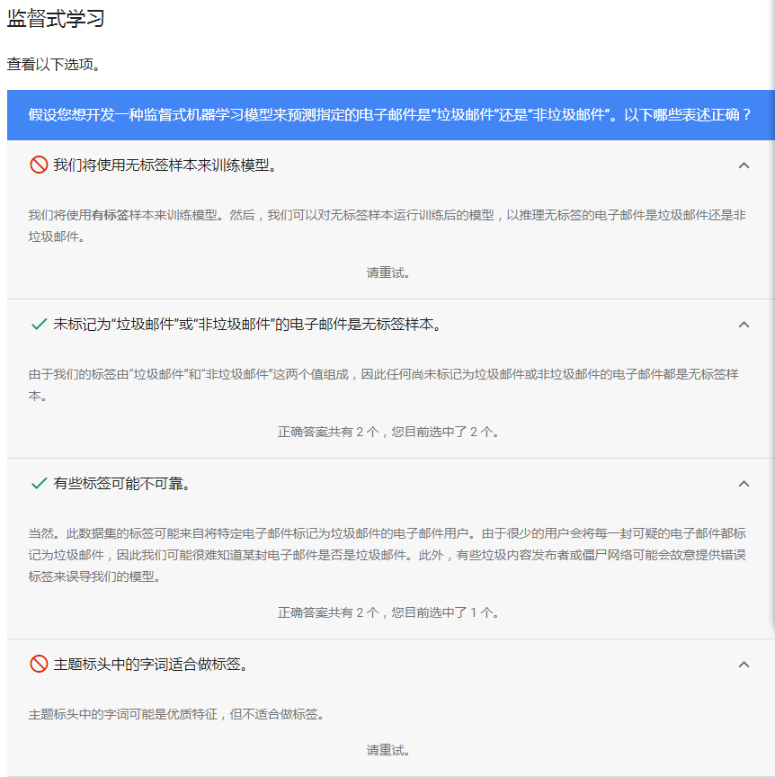
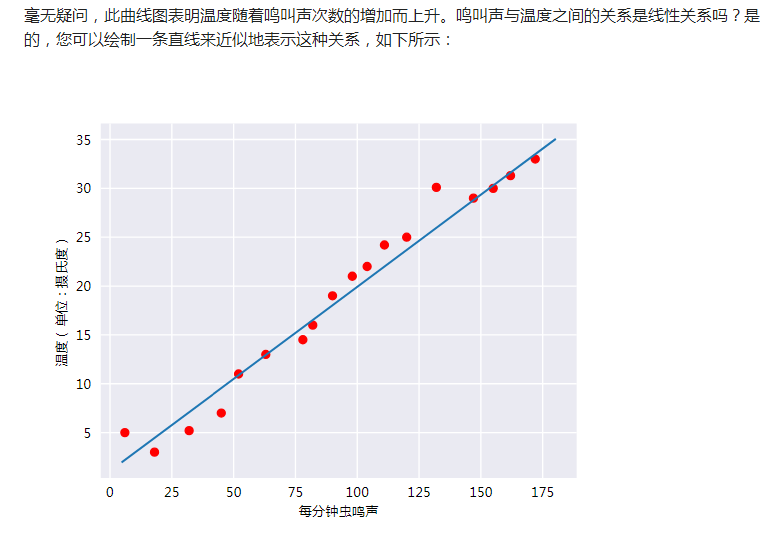
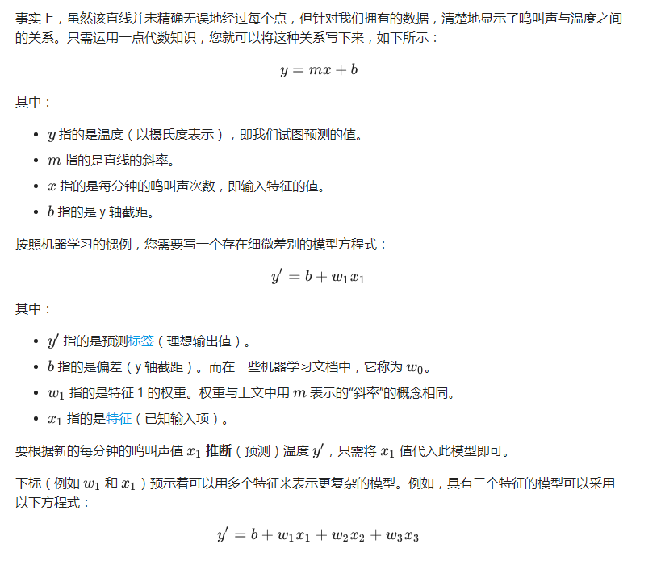
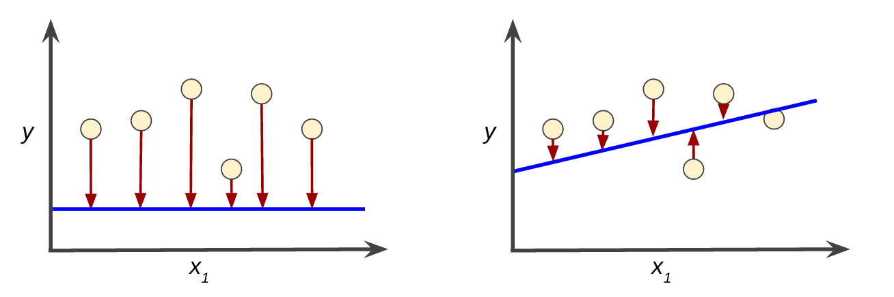
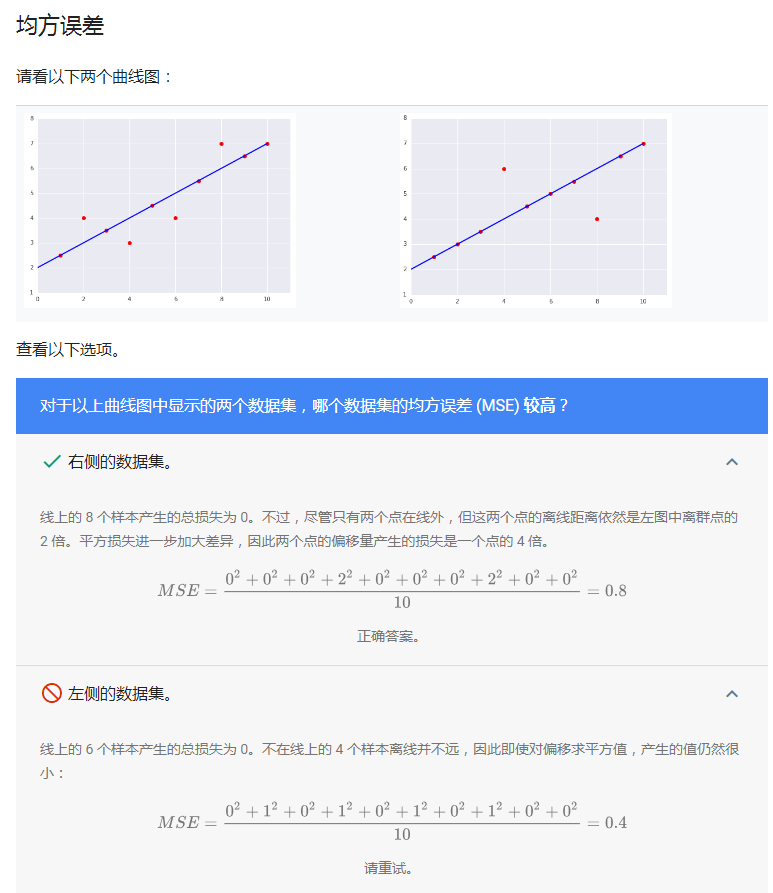

# 本资源内容
这个资源涵盖了谷歌机器学习速成课程（中文版）的所有内容，主要是为了方便国内机器学习爱好者学习这门课程。内容主要以加利福尼亚房价预测为线索，讲解了使用机器学习和深度学习解决现实世界的一般问题。

**资源说明表格**

|名称|说明|
|-|-|
|完整版[Google机器学习速成课程.md](Google机器学习速成课程.md)||
|[谷歌机器学习速成课程-配套TensorFlow代码](Google机器学习速成课程Code)|加利福利亚放假回归问题+分类问题+手写字体识别问题|
|[Google机器学习速成课程.pdf](Google机器学习速成课程.pdf)||
|[机器学习术语表（PDF）](Google机器学习速成课程相关PDF资源/机器学习术语表GoogleDevelopers.pdf)|[机器学习术语表（网页版）](https://developers.google.com/machine-learning/glossary/)|
|[机器学习规则（PDF）](Google机器学习速成课程相关PDF资源/机器学习规则GoogleDevelopers.pdf)|[机器学习规则（网页版）](https://developers.google.com/machine-learning/guides/rules-of-ml/)|

## 谷歌机器学习速成课程的目录

# 机器学习概念
## 机器学习简介
学习目标
+ 了解掌握机器学习技术的实际优势
+ 理解机器学习技术背后的理念

**机器学习与普通编程对比**

|机器学习的解决方案|普通编程的解决方案|
|-|-|
|**机器学习可以提供一个缩短编程时间的工具**。比如编写一个程序来纠正拼写错误，只需向现成的机器学习工具提供一些样本就可以在短时间内获得一个可靠的程序。|普通编程通过大量示例和经验法则，以及数周努力编写一个合理的程序。|
|**借助起学习可以自定义自己的产品，使其更适合特定的用户群体**。只需要收集该特定语言的数据，然后将数据提供给完全一样的机器学习模型学习，就可以提供多种语言版本的拼写检查程序。|手动编写了一个英文拼写纠错程序，如果打算针对100种最常用语言提供相应版本，这样一来每一种语言版本几乎都要从头开始，将付出数年的努力。|
|**借助机器学习可以解决不知道如何使用人工方法解决的问题**。比如识别出朋友的面孔，理解他们所说的话。|普通编程无法很好解决。|

## 框架处理
学习目标
+ 复习机器学习基本术语。
+ 了解机器学习的各种用途。
### 机器学习术语
|术语|解释|
|-|-|
|（监督式）机器学习？|机器学习系统通过学习如何组合输入信息来对从未见过的数据做出有用的预测。|
|标签|标签是我们要预测的事物，即简单线性回归中的$y$变量。标签可以是小麦未来的价格、图片中显示的动物品种、音频剪辑的含义或任何事物。|
|特征|特征是输入变量，即简单线性回归中的$x$变量。简单的机器学习项目可能会使用单个特征，而比较复杂的机器学习项目可能会使用数百万个特征，按如下方式指定：$x_1, x_2,...,x_N$。在垃圾邮件检测器示例中，特征可能包括：电子邮件文本中的字词、发件人的地址、发送电子邮件的时段、、电子邮件中包含“一种奇怪的把戏”这样的短语。|
|样本|样本是指数据的特定实例：$\pmb{x}$。（我们采用粗体$\pmb{x}$表示它是一个矢量。）我们将样本分为以下两类：有标签样本、无标签样本。**有标签样本**具有 {特征, 标签}：(x, y)， 用于训练模型。**无标签样本**具有 {特征, ?}：(x, ?)，用于对新数据做出预测。在我们的垃圾邮件检测器示例中，有标签样本是用户明确标记为“垃圾邮件”或“非垃圾邮件”的各个电子邮件。在使用有标签样本训练模型之后，我们会使用该模型预测无标签样本的标签。在垃圾邮件检测器示例中，无标签样本是用户尚未添加标签的新电子邮件。|
|模型|模型定义了特征与标签之间的关系。例如，垃圾邮件检测模型可能会将某些特征与“垃圾邮件”紧密联系起来。我们来重点介绍一下模型生命周期的两个阶段：训练是指创建或学习模型。也就是说，向模型展示有标签样本，让模型逐渐学习特征与标签之间的关系。推断是指将训练后的模型应用于无标签样本。|
|回归模型|回归模型可预测连续值。例如，回归模型做出的预测可回答如下问题：加利福尼亚州一栋房产的价值是多少？用户点击此广告的概率是多少？|
|分类模型|分类模型可预测离散值。例如，分类模型做出的预测可回答如下问题：某个指定电子邮件是垃圾邮件还是非垃圾邮件？这是一张狗、猫还是仓鼠图片？|
+ [机器学习术语表（网页）](https://developers.google.com/machine-learning/glossary/)
+ [机器学习术语表（PDF）](Google机器学习速成课程相关PDF资源/机器学习术语表GoogleDevelopers.pdf)
### 习题

## 深入了解机器学习
学习目标
+ 复习前面学过的直线拟合知识。
+ 将机器学习中的权重和偏差与直线拟合中的斜率和偏移关联起来。
+ 大致了解“损失”，详细了解平方损失。
### 线性回归

### 训练与损失
简单来说，训练模型表示通过有标签样本来学习（确定）所有权重和偏差的理想值。在监督式学习中，机器学习算法通过以下方式构建模型：检查多个样本并尝试找出可最大限度地减少损失的模型；这一过程称为经验风险最小化。

损失是对糟糕预测的惩罚。也就是说，损失是一个数值，表示对于单个样本而言模型预测的准确程度。如果模型的预测完全准确，则损失为零，否则损失会较大。训练模型的目标是从所有样本中找到一组平均损失“较小”的权重和偏差。例如，图 3 左侧显示的是损失较大的模型，右侧显示的是损失较小的模型。关于此图，请注意以下几点：
+ 红色箭头表示损失。
+ 蓝线表示预测。

请注意，左侧曲线图中的红色箭头比右侧曲线图中的对应红色箭头长得多。显然，相较于左侧曲线图中的蓝线，右侧曲线图中的蓝线代表的是预测效果更好的模型。

### 习题

